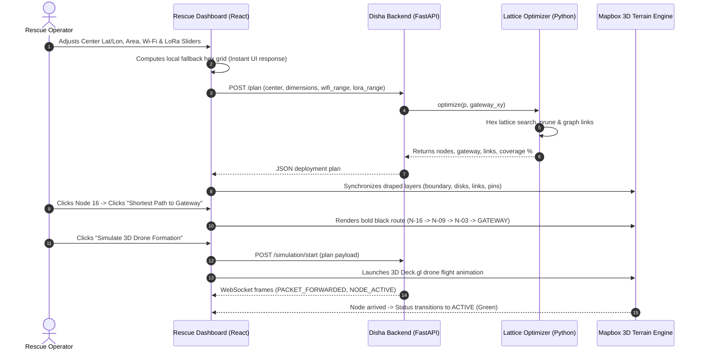

# Disha Project Progress & Technical Documentation

> **Autonomous Disaster-Response Mesh Network & 3D Drone Deployment Simulator**  
> *A rapid-deployment emergency telecommunications system for disaster zones where cellular infrastructure is compromised.*

---

## 1. Project Overview & Architecture

When severe natural disasters strike (earthquakes, flash floods, landslides), existing telecommunication networks (cellular towers, fiber backhauls) often fail. **Disha** is an autonomous disaster response system designed to restore emergency connectivity within minutes.

### Core Philosophy
1. **Survivors** connect their everyday mobile phones to standard, unencrypted **Wi-Fi hotspots** broadcasted by deployed nodes without needing any cellular service or specialized apps.
2. **Nodes** relay emergency requests (medical priority, triage location, survivor SOS) over long-range, low-power **LoRa mesh radio links**.
3. **Autonomous Drones** fly out from a command base station to deploy or position the nodes according to a mathematically optimized formation.
4. **Responders & Incident Commanders** monitor the live mesh, survivor calls, and node statuses on the **3D Rescue Dashboard**.

```
┌─────────────────┐       Wi-Fi (100–500m)       ┌────────────────────────┐
│ Survivor Phone  │ ───────────────────────────> │ Autonomous Mesh Node   │
└─────────────────┘                              └────────────────────────┘
                                                             │
                                                     LoRa (500–1500m)
                                                             │
                                                             ▼
┌──────────────────┐     WebSocket / REST API    ┌────────────────────────┐
│ Rescue Dashboard │ <────────────────────────── │ Gateway / Base Station │
│  (3D Visualizer) │                             └────────────────────────┘
└──────────────────┘
```

---

## 2. Completed Features Inventory

### A. Backend Deployment Planner (`backend/`)
- **Hexagonal Lattice Coverage Optimizer ([optimize.py](file:///Users/sanyamnandal/drone-3d-simulator/backend/deployment/optimize.py)):**
  - Mathematical disk-packing algorithm covering 100% of the designated disaster area while minimizing total drone node count.
  - Boundary clipping logic guaranteeing all generated nodes sit strictly within the rectangular disaster boundary.
  - Adaptive resolution steps (`plan_step`) preventing CPU lockups during small radio ranges or large disaster areas.
  - Pruning pass removing redundant interior nodes while maintaining multi-path LoRa connectivity.
- **Graph Link Builder & Hop-Count Calculator ([planner.py](file:///Users/sanyamnandal/drone-3d-simulator/backend/deployment/planner.py), [run_planner.py](file:///Users/sanyamnandal/drone-3d-simulator/backend/deployment/run_planner.py)):**
  - Pairwise Euclidean distance calculations to create bidirectional LoRa links whenever $d \le \text{lora\_range\_m}$.
  - Breadth-First Search (BFS) computing `hops_from_gateway` for every node.
  - Staggered deployment order scheduling prioritizing gateway-adjacent relays first.
  - Fallback mechanism ensuring continuous execution if optimization requires relaxation.
- **FastAPI REST & WebSocket Server ([main.py](file:///Users/sanyamnandal/drone-3d-simulator/backend/main.py)):**
  - `POST /plan`: Computes node placements, link topologies, coverage percentage, and deployment orders.
  - `POST /simulation/start`: Boots the discrete-event mesh network simulation engine.
  - `GET /events`: Queries recent packet forwarding, node failures, and route changes.
  - `WebSocket /ws/events`: Streams real-time network telemetry frames directly to the frontend.

---

### B. 3D Rescue Dashboard (`frontend/rescue-dashboard/`)
- **3D Satellite Terrain Visualizer ([Map3DView.jsx](file:///Users/sanyamnandal/drone-3d-simulator/frontend/rescue-dashboard/src/components/Map3DView.jsx)):**
  - Built with **Mapbox GL JS v3** with real-world Digital Elevation Models (DEM) for authentic mountainous/valley topography.
  - **Zero-Parallax Draped Layers:** Uses native Mapbox vector layers (`circle-pitch-alignment: 'map'`, draped lines, and polygons) for disaster boundary polygons, Wi-Fi coverage disks, mesh lines, node pins, number labels, and gateway markers. This eliminates elevation parallax displacement, keeping nodes fixed on ground coordinates even at $60^\circ$ camera pitch.
- **Shortest Path to Gateway (Black Route Highlight):**
  - Implemented Dijkstra's algorithm ([geoMath.js](file:///Users/sanyamnandal/drone-3d-simulator/frontend/rescue-dashboard/src/utils/geoMath.js)) weighted by link distance.
  - Clicking any node provides a **"Shortest Path to Gateway"** action that renders a bold black route (`#000000`, $5.5\text{px}$) tracing the optimal multi-hop backhaul path to the base station.
  - Displays hop count and node sequence in the sidebar.
- **Interactive Radio Parameter Sliders ([SidebarControls.jsx](file:///Users/sanyamnandal/drone-3d-simulator/frontend/rescue-dashboard/src/components/SidebarControls.jsx)):**
  - **Wi-Fi Coverage Radius Slider:** $100\text{ m} - 500\text{ m}$ ($10\text{ m}$ steps) with one-click presets (`100m`, `200m`, `300m`, `400m`, `500m`). Controls each node's Wi-Fi hotspot circle on the map.
  - **LoRa Mesh Spacing Slider:** $500\text{ m} - 1500\text{ m}$ ($25\text{ m}$ steps) with one-click presets (`500m`, `750m`, `1000m`, `1250m`, `1500m`). Dynamically recalculates mesh spacing and link thresholds.
- **Full Coverage Rings & Clear Node Labels:**
  - Displays Wi-Fi coverage rings for all nodes: soft cyan dashed circles for planned nodes and vibrant green glowing disks for active nodes.
  - Every node is stamped with a high-contrast number badge (`1` to $N$) for rapid operator identification.
  - Prominent orange command badge for the **GATEWAY Base Station** at the deployment perimeter.
- **3D Autonomous Drone Flight Animation:**
  - Built with **Deck.gl v9** overlays calculating real-time terrain elevations (`queryTerrainElevation`).
  - Drones fly $35\text{ m}$ above ground level (AGL) along smooth sinusoidal ease-in-out arcs from the gateway launch pad to their destination coordinates.
  - Dispatches custom arrival events that trigger node status transitions (`PLANNED` $\to$ `ACTIVE`).
- **Camera Navigation Controls & Legend:**
  - Floating toolbar with `🏔 3D View / 🗺 2D Top-Down` toggle, `🎯 Focus Area`, and `🧭 North` reset.
  - Bottom-left color-coded map legend detailing all visual elements.
- **Mission Autopilot Exporter:**
  - One-click export producing standard `drone-mission-<timestamp>.json` waypoint files compatible with autopilot flight controllers (ArduPilot / PX4).
- **Local Fallback Grid:**
  - Self-contained geospatial hex packing calculation ensuring the dashboard remains usable even when working offline without the backend server.

---

## 3. End-to-End Workflow & Data Lifecycle



---

## 4. How to Run the Project Locally

### Prerequisites
- **Python**: 3.10 or higher
- **Node.js**: v18.0 or higher
- **Mapbox Access Token**: Free token from [mapbox.com](https://account.mapbox.com/)

### Step 1: Start the Backend Server
```bash
# Navigate to the project root
cd /path/to/drone-3d-simulator

# Activate virtual environment (if using one)
source .venv/bin/activate  # or conda activate

# Install backend dependencies
pip install fastapi uvicorn matplotlib numpy pydantic

# Start Uvicorn development server on port 8000
uvicorn backend.main:app --reload --port 8000
```
*Health check:* Visit `http://localhost:8000/` in your browser. It should return `{"status": "ok", "service": "Disha Emergency Network API"}`.

---

### Step 2: Configure & Start the Frontend Dashboard
```bash
# Navigate to the frontend directory
cd frontend/rescue-dashboard

# Create local environment file with your Mapbox token
cp .env.example .env
# Edit .env and insert your Mapbox access token:
# VITE_MAPBOX_TOKEN=pk.eyJ1IjoieW91ci11c2VybmFtZSIsImEiOiJ5b3VyLXRva2VuIn0...

# Install Node dependencies
npm install

# Start Vite dev server
npm run dev
```
*Access the dashboard:* Open the URL output in your terminal (typically `http://localhost:5173` or `http://localhost:5176`).

---

## 5. User Guide: How to Use the Dashboard

1. **Set Disaster Center & Area:**
   - In the sidebar, specify the **Latitude**, **Longitude**, and **Affected Area** (e.g. $4\text{ km}^2 = 2.0\text{ km} \times 2.0\text{ km}$).
   - The map smoothly flies to the location and renders the cyan boundary box.
2. **Tune Radio Parameters:**
   - Drag the **Wi-Fi Coverage Radius slider** between $100\text{ m}$ and $500\text{ m}$. Watch the coverage circles resize in real time.
   - Adjust the **LoRa Link / Mesh Spacing slider** ($500\text{ m} - 1500\text{ m}$) to increase or decrease inter-node relay distance.
3. **Inspect Nodes & Routes:**
   - Click on any node circle on the map to open **Selected Node Details**.
   - Review coordinates, altitude, status, and telemetry.
   - Click **"Shortest Path to Gateway"** to highlight the optimal routing path to the base station in **black**.
4. **Switch Perspectives:**
   - Use the floating map toolbar in the top-left to toggle between `🏔 3D View` (perspective terrain) and `🗺 2D Top-Down` (orthogonal view).
   - Click `🎯 Focus Area` to automatically re-center and frame the disaster zone.
5. **Run Formation Simulation:**
   - Click the purple **"Simulate 3D Drone Formation"** button.
   - Watch autonomous drones depart from the Gateway pad, cruise along 3D arcs across the terrain, and deploy each node.
6. **Export Mission Plan:**
   - Click **"Export Autopilot Waypoints (JSON)"** to download the deployment JSON file for autonomous drone fleet execution.

---

## 6. Key Project Files Reference

| File | Purpose |
| :--- | :--- |
| [`backend/main.py`](file:///Users/sanyamnandal/drone-3d-simulator/backend/main.py) | FastAPI backend serving `/plan`, `/simulation/start`, and WebSocket streams. |
| [`backend/deployment/optimize.py`](file:///Users/sanyamnandal/drone-3d-simulator/backend/deployment/optimize.py) | Hexagonal lattice coverage optimizer with strict boundary clipping. |
| [`backend/deployment/run_planner.py`](file:///Users/sanyamnandal/drone-3d-simulator/backend/deployment/run_planner.py) | Multi-hop deployment planner, BFS hop calculator, and export generator. |
| [`frontend/rescue-dashboard/src/components/Map3DView.jsx`](file:///Users/sanyamnandal/drone-3d-simulator/frontend/rescue-dashboard/src/components/Map3DView.jsx) | 3D satellite map with native draped terrain layers, black shortest path, and drone flights. |
| [`frontend/rescue-dashboard/src/components/SidebarControls.jsx`](file:///Users/sanyamnandal/drone-3d-simulator/frontend/rescue-dashboard/src/components/SidebarControls.jsx) | Sidebar panel with radio sliders, shortest path trigger, and node telemetry. |
| [`frontend/rescue-dashboard/src/utils/geoMath.js`](file:///Users/sanyamnandal/drone-3d-simulator/frontend/rescue-dashboard/src/utils/geoMath.js) | Geodesic math, Dijkstra shortest path algorithm, and autopilot export builder. |
| [`frontend/rescue-dashboard/src/utils/backendApi.js`](file:///Users/sanyamnandal/drone-3d-simulator/frontend/rescue-dashboard/src/utils/backendApi.js) | Client integration layer for Disha FastAPI backend with graceful fallback. |

---

## 7. Roadmap & Next Steps
- [ ] Connect ESP32 Wi-Fi sniffing hardware for passive survivor mobile phone detection.
- [ ] Incorporate live elevation profile elevation queries for no-fly obstacle avoidance.
- [ ] Integrate real LoRa gateway serial uplink for hybrid simulated/hardware operation.
